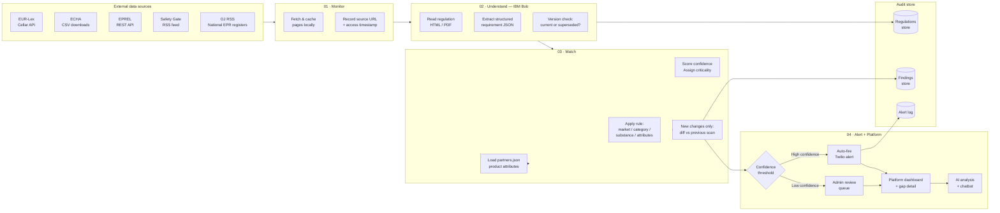
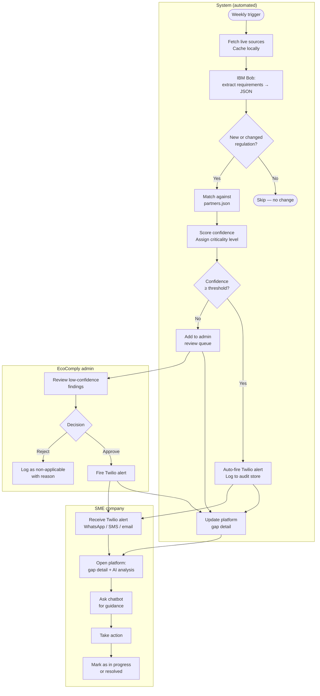
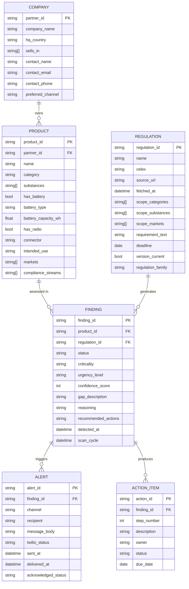
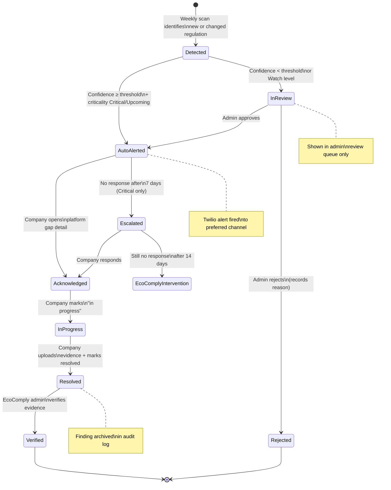
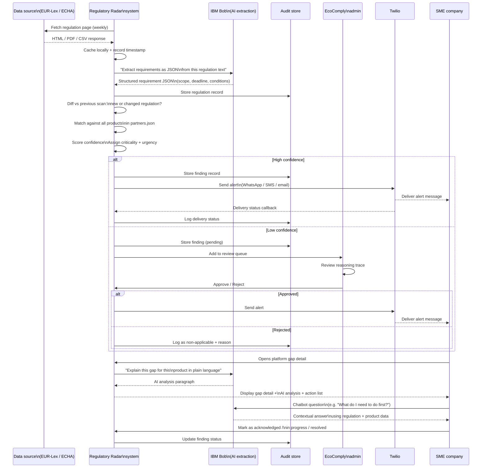

# Regulatory Radar — Product Plan
**GDGoC TUM Campus Heilbronn · IBM Bobathon · Partner challenge by EcoComply**

> Automated EU compliance intelligence for electronics SMEs.  
> EcoComply currently provides "visibility only." Regulatory Radar automates the full loop:  
> **monitor → understand → match → alert** — surfaced in a platform both EcoComply staff and their SME clients can use.

---

## Table of Contents

1. [Dataset context](#1-dataset-context)
2. [Positioning vs EcoComply](#2-positioning-vs-ecocomply)
3. [System architecture — DFD](#3-system-architecture--data-flow-diagram)
4. [Core pipeline — BPMN](#4-core-pipeline--bpmn-swimlane)
5. [Data model — ERD](#5-data-model--erd)
6. [Alert design — criticality + urgency + actions](#6-alert-design)
7. [Gap lifecycle — state diagram](#7-gap-lifecycle--state-diagram)
8. [Alert sequence — sequence diagram](#8-alert-sequence--sequence-diagram)
9. [Platform feature map](#9-platform-feature-map)
10. [Evaluation criteria](#10-evaluation-criteria)
11. [Jury alignment](#11-jury-alignment)
12. [Technical notes](#12-technical-notes)

---

## 1. Dataset context

| Figure | Value | Source |
|---|---|---|
| SME companies in portfolio | 22 | Challenge repo README |
| Products to assess | 53 | Challenge repo README |
| Data sources monitored | ~10 | SOURCES.md (EUR-Lex, ECHA, EPREL, Safety Gate + 6 more) |
| Regulation families covered | ~12 | SOURCES.md (RoHS, REACH, Batteries, PPWR, RED, GPSR…) |
| Fine risk per non-compliant market | €100,000+ | EcoComply pitch slide |
| Scan frequency | Once per week | Product target |
| Extraction accuracy target | 95% | Product target |

> **Hackathon data strategy:** Pages are cached locally on first pull to avoid rate limits and survive venue WiFi outages. In production, EcoComply holds commercial API licences for stable, high-frequency access.

---

## 2. Positioning vs EcoComply

| | EcoComply today | Regulatory Radar adds |
|---|---|---|
| Monitoring | Manual — staff read legislation portals | Automated weekly fetch from live sources |
| Gap detection | Manual — staff map rules to clients by hand | AI-reasoned per product, per regulation |
| Alerting | Manual — staff email clients one by one | Proactive Twilio alerts (WhatsApp / SMS / email) |
| Client interface | Dashboard showing applicable regulations | Dashboard + gap detail + AI analysis + chatbot |
| Human expert layer | CE, DoC, lab coordination, EU AR | Preserved — Radar surfaces the need; experts execute |

> EcoComply's own framing of the "compliance platform" tier: *"You pay for visibility, but still do all the work."*  
> Regulatory Radar automates the monitor → assess → alert loop so that work shrinks dramatically.

---

## 3. System architecture — Data Flow Diagram



---

## 4. Core pipeline — BPMN swimlane

Runs **once per week** on schedule. Can also be triggered manually by an admin.



---

## 5. Data model — ERD



---

## 6. Alert design

Every alert carries **two independent dimensions** and an **exact ordered action list.**

### 6.1 Two dimensions: criticality and urgency

These are separate axes — a low-urgency gap can still be high-criticality, and vice versa.

#### Criticality — what is at stake if the company does nothing

| Level | Badge | Definition | Consequences shown in alert |
|---|---|---|---|
| High | 🔴 Critical | Regulation imposes severe market penalties if violated | €100k+ fine per market · Market ban with no grace period · Marketplace delisting · Brand damage |
| Medium | 🟡 Moderate | Regulation requires corrective action; enforcement is graduated | Warning notice from market authority · Required corrective action plan · Potential product recall |
| Low | 🟢 Administrative | Reporting or registration obligation; no immediate product impact | Registration fee or administrative penalty · Reporting deadline missed on record |

#### Urgency — when the company must act

| Level | Badge | Definition | Time window | Alert tone |
|---|---|---|---|---|
| Immediate | 🚨 Act now | Already violating an in-force regulation. No grace period remaining. | 0 days — non-compliant today | "Your product is non-compliant **right now**. Every day without action is a day of exposure." |
| Short-term | ⏰ Act within weeks | Deadline in fewer than 90 days. Insufficient time to complete remediation without starting immediately. | < 90 days | "You have [N] days. Most remediation steps take 4–8 weeks minimum." |
| Medium-term | 📅 Plan now | Deadline in 90 days to 1 year. Enough time if planning starts immediately. | 90 days – 1 year | "Deadline is in [N] months. Start scoping now to avoid a last-minute scramble." |
| Long-term | 🗓️ Schedule | Deadline more than 1 year away (up to ~3 years). Monitor and schedule. | 1 – 3 years | "Deadline is [date]. Add to your compliance roadmap — this is not urgent but must not be forgotten." |

### 6.2 Exact alert structure

Every alert — whether delivered via Twilio (WhatsApp/SMS/email) or displayed in the platform — contains all of the following fields in this order:

```
[CRITICALITY BADGE] [URGENCY BADGE] — Regulatory Radar

Company:      {company_name}
Product:      {product_name} ({category})
Regulation:   {regulation_name}
Deadline:     {deadline_date} · {days_remaining} days remaining

WHAT IS REQUIRED
{requirement_text — plain language, 1–2 sentences}

THE GAP
{gap_description — specific to this product's attributes}

WHY THIS APPLIES TO YOU
{reasoning — which product attribute triggered the rule, e.g. "Your ProScan 3000 has a 3.2kWh portable battery, which exceeds the 2kWh threshold in Article 13."}

CONSEQUENCES IF IGNORED
{consequences — drawn from criticality level, specific to this regulation}

ACTIONS REQUIRED (in order)
{ordered action list — see Section 6.3}

Source:       {source_url} · fetched {fetched_at}
Confidence:   {confidence_score}%

Reply HELP to speak to an EcoComply compliance expert.
```

> **Twilio SMS version:** Compressed to ≤300 characters with a link to the full platform gap detail.  
> **Platform version:** Full structured display with expand/collapse per section.

### 6.3 Ordered action lists by regulation

These are the exact, ordered steps shown in every alert and on the platform gap detail screen. Steps are numbered so companies can track progress item by item.

---

#### EU Batteries Regulation — 2023/1542

*Applies when: `has_battery = true` AND `battery_capacity_wh > 2000` AND `markets` includes EU*

| Step | Action | Responsible | Notes |
|---|---|---|---|
| 1 | Confirm battery specifications: type, capacity (Wh), cell chemistry | Product / R&D team | Required data for passport |
| 2 | Collect carbon footprint data per kWh across the battery lifecycle | Supply chain / procurement | Supplier declarations needed |
| 3 | Collect recycled content data: cobalt, lithium, nickel, lead % | Supply chain | Per Annex XIII |
| 4 | Complete supply chain due diligence documentation | Legal / procurement | |
| 5 | Register product in EPREL (battery product group) | Compliance manager | Free registration |
| 6 | Generate Digital Product Passport record in EPREL | Compliance / IT | Links via QR code |
| 7 | Attach QR code to product and packaging before EU market placement | Operations | |
| 8 | Update technical file and Declaration of Conformity (DoC) | Compliance manager | |
| **Deadline** | **18 February 2027** for portable batteries; earlier for industrial | | |

---

#### RoHS Directive — 2011/65/EU (as amended)

*Applies when: `category` is electrical/electronic equipment AND `markets` includes EU AND `intended_use` is not purely industrial*

| Step | Action | Responsible | Notes |
|---|---|---|---|
| 1 | Identify all restricted substances in the product: Pb, Hg, Cd, Cr6+, PBBs, PBDEs, DEHP, DBP, BBP, DIBP | R&D / materials team | Use IEC 62474 material declaration format |
| 2 | Collect material declarations from all component suppliers | Procurement | Must cover all homogeneous materials |
| 3 | Check applicable exemptions (Annex III / IV of Directive) for your product category | Compliance manager | Many exemptions exist — do not assume non-compliant |
| 4 | Commission lab testing if supplier declarations insufficient | Compliance manager | Use accredited EU lab |
| 5 | Compile technical documentation | Compliance manager | Keep for 10 years |
| 6 | Issue EU Declaration of Conformity | Authorised representative | |
| 7 | Apply CE marking | Operations | |
| **Deadline** | **In force now** — no transition period for new products | | |

---

#### REACH — SVHC Candidate List (Regulation EC 1907/2006)

*Applies when: `substances` contains an ECHA SVHC Candidate List substance AND concentration > 0.1% w/w in any article*

| Step | Action | Responsible | Notes |
|---|---|---|---|
| 1 | Check current ECHA SVHC Candidate List for all substances in `substances[]` field | Compliance manager | List updated twice yearly — re-check each cycle |
| 2 | Determine concentration of each SVHC in each article (not product total) | R&D / materials | Threshold is 0.1% w/w per article |
| 3 | If threshold exceeded: notify ECHA via SCIP database (Article 9 PPWR/REACH) | Compliance manager | Notification within 6 months of placing on market |
| 4 | Communicate SVHC presence to downstream users and on request to consumers | Sales / customer service | Within 45 days of request |
| 5 | Evaluate substitution: is a safer alternative technically and economically feasible? | R&D | Document substitution assessment |
| 6 | Update product documentation and SDS if applicable | Compliance manager | |
| **Deadline** | **In force now** — obligation applies at point of placing on market | | |

---

#### General Product Safety Regulation — GPSR 2023/988

*Applies when: `intended_use` includes `consumer` AND `markets` includes EU*

| Step | Action | Responsible | Notes |
|---|---|---|---|
| 1 | Conduct product risk assessment: identify hazards, evaluate risks, implement safety measures | R&D / compliance | Document the full assessment |
| 2 | If manufacturer is non-EU: appoint an EU Authorised Representative | Legal / management | Required under GPSR Article 16; EcoComply can fulfil this role |
| 3 | Register product in the Safety Gate portal if required for your category | Compliance manager | Mandatory for certain high-risk categories |
| 4 | Establish an internal market surveillance contact point | Operations | Must be reachable by EU authorities |
| 5 | Prepare and maintain technical file: risk assessment, test reports, user instructions | Compliance manager | Keep for 10 years |
| 6 | Apply GPSR-compliant labelling: manufacturer name, address, product identifier | Operations | |
| 7 | Establish a complaints and recall procedure | Operations | Must be documented |
| **Deadline** | **13 December 2024** — GPSR already in force | | |

---

#### WEEE / EPR — ElektroG (Germany)

*Applies when: `category` is EEE AND `markets` includes DE*

| Step | Action | Responsible | Notes |
|---|---|---|---|
| 1 | Register as a producer with Stiftung EAR (ear-Öffentliches Register) | Compliance manager / legal | Free online registration |
| 2 | Join an authorised WEEE take-back scheme | Operations | Must be one of the ear-registered systems |
| 3 | Mark products with the crossed-out wheelie bin symbol (plus manufacture date) | Operations / design | Required on all EEE placed on DE market |
| 4 | Report annual quantities placed on the German market to Stiftung EAR | Compliance manager | Annual reporting deadline: varies by category |
| 5 | Finance collection, sorting, and recycling for your product category | Finance / operations | Via take-back scheme membership fee |
| **Deadline** | **In force now** — registration must precede first sale in Germany | | |

---

#### PPWR — Packaging and Packaging Waste Regulation 2025/40

*Applies when: `packaging` is not null AND `markets` includes EU*

| Step | Action | Responsible | Notes |
|---|---|---|---|
| 1 | Classify all packaging types: primary, secondary, transport | Operations / supply chain | Each type has different obligations |
| 2 | Calculate recyclability rate for each packaging unit | R&D / operations | Minimum recyclability thresholds apply |
| 3 | Assess recycled content in plastic packaging | Procurement | Mandatory minimum % from 2030 |
| 4 | Evaluate if packaging is minimised (no unnecessary packaging elements) | Design / operations | |
| 5 | Register with national EPR scheme for packaging in each EU market | Compliance manager | Each member state has its own register |
| 6 | Report annual packaging quantities placed on market | Compliance manager | Per country |
| **Deadline** | **12 August 2026** for initial obligations; further phases to 2030 | | |

---

## 7. Gap lifecycle — state diagram



---

## 8. Alert sequence — sequence diagram



---

## 9. Platform feature map

### Shared features — all list views

Every list view in the platform (both admin and customer) supports the following:

**Sorting (default applied automatically):**
- Primary: criticality descending — Critical first, then Upcoming, then Watch, then compliant
- Secondary (within same criticality level): urgency level descending — Immediate first, then Short-term, Short-term, Medium-term, Long-term
- Tertiary: deadline ascending — soonest deadline first within same urgency level
- User can override: toggle to sort by company name, regulation name, or detected date

**Filters (shown in filter bar above every list):**
- By criticality level: Critical / Upcoming / Watch / All *(single-select)*
- By urgency level: Immediate / Short-term / Medium-term / Long-term / All *(single-select)*
- By product category: multi-select dropdown — only shown when the selected company (or portfolio) has products in more than one category
- By regulation family: RoHS / REACH / Batteries / PPWR / GPSR / RED / WEEE / Other *(multi-select)*
- By market: EU / DE / FR / other *(multi-select)*
- By status: Gap confirmed / Non-applicable / Compliant / In review / Acknowledged / In progress / Resolved *(multi-select)*
- By confidence: slider (0–100%)

**Search:** free-text across company name, product name, regulation name, gap description.

**Export:** download current filtered view as JSON (matching `sample_expected_output.json` schema).

---

### Admin view — EcoComply staff

#### A1 · Portfolio dashboard

Full portfolio status matrix: company (row) × regulation family (column). Cell colour = worst criticality for that pairing.

- Top strip: count of Critical gaps / Upcoming gaps / companies with unreviewed low-confidence findings
- "Run scan now" button — manual trigger outside weekly schedule
- Filters: all shared filters, plus filter by HQ country
- Sorting: companies with most Critical gaps first (default); override to alphabetical or by total gap count
- Click company row → Company profile (A3)

#### A2 · Review queue

Low-confidence findings held for human verification before any alert fires.

- Default sort: criticality descending, then confidence ascending (lowest confidence = needs most scrutiny)
- Filters: by regulation, by company, by confidence range, by criticality
- Each finding shows: company, product, regulation, gap summary, confidence score, AI reasoning trace (which product attributes drove the match, and which exclusion checks passed/failed)
- Actions per finding: **Approve** (fires Twilio alert) / **Reject** (marks non-applicable + requires reason text) / **Escalate** (assigns to named staff member)
- Rejected findings are logged with reason and never re-alerted for the same regulation version

#### A3 · Company profile

- Company metadata: HQ country, markets, contact, preferred alert channel
- Product list with all attributes (category, substances, battery type/capacity, has_radio, connector, markets, intended_use)
- Compliance status per product per regulation
- Filters: by product category *(shown when company has >1 category)*, by regulation family, by criticality, by urgency
- Sorting: Critical + Immediate first, then Critical + Short-term, then Upcoming + Immediate, and so on
- Gap history: previous findings, resolution method, evidence uploaded
- Click any gap row → Gap detail (shared screen)

#### A4 · Regulation library

- All extracted regulations from live sources
- Each record: regulation name, CELEX, source URL, fetch timestamp, scope summary, deadline, current/superseded flag
- Filters: by regulation family, by affected product category, by market, by deadline range
- Source health panel: per source — last successful fetch timestamp, HTTP status, next scheduled fetch; red indicator if source not fetched in >8 days
- "Affected companies" count per regulation — click to filter portfolio view
- Manual re-fetch button per source (admin only)

#### A5 · Alert log (all companies)

Full audit trail of every alert ever sent.

- Default sort: most recent first
- Filters: by company, by regulation, by channel, by delivery status (delivered / failed / pending), by date range, by acknowledgement status
- Each record: timestamp, company, product, regulation, channel, Twilio delivery status, message preview
- "Resend" button per alert
- Export to JSON (full audit format)

#### A6 · Accuracy & coverage dashboard

Internal performance metrics, measured against evaluation criteria:

- Extraction accuracy rate (spot-check input vs Bob JSON output)
- Matching precision and recall (verified against known-gap companies)
- False positive rate (flagged non-applicable cases verified manually)
- Alert delivery rate (from Twilio delivery status API)
- Source coverage rate (% sources successfully fetched last cycle)
- Time to alert (regulation publish timestamp → Twilio send timestamp)

#### A7 · Scan configuration

- Confidence threshold slider: above = auto-alert, below = review queue
- Source toggles: enable/disable individual sources
- Weekly schedule setting (day of week, time)
- Alert channel defaults per company (overridable per company profile)
- "New changes only" toggle: confirmed on by default; off = re-assess all regulations each cycle

---

### Customer view — SME company

Sees only their own company's products and findings.

#### C1 · My compliance dashboard

- Product cards: each shows compliance status per regulation family. Colour = worst criticality for that product
- Summary strip: Critical gap count / Upcoming gap count / next soonest deadline
- **Category filter:** shown as prominent multi-select tabs at the top of the product list when the company has products in more than one category (e.g. "All · Portable scanner · Power tool · Consumer electronics")
- Additional filters: by regulation family, by criticality, by urgency, by market
- **Sorting:** Critical + Immediate at the top by default. Secondary: deadline ascending. User can override to sort by product name or regulation

#### C2 · Deadline timeline

- All upcoming compliance deadlines across all my products, sorted by deadline ascending (soonest first)
- Each item: product name, regulation, criticality badge, urgency badge, days remaining (red if < 90 days)
- Filters: by product category *(multi-select, if >1 category)*, by regulation family, by criticality
- Completed/Watch items hidden by default; toggle to include

#### C3 · Gap detail

One finding, fully explained:

- Criticality badge + urgency badge (prominently at the top)
- Product name, category, and the specific attributes that triggered the rule
- Regulation name, requirement in plain language, deadline, days remaining
- The specific gap: what is missing or non-compliant for this product
- **Why this applies to you:** which attribute value crossed the threshold (e.g. "Your battery capacity of 3.2kWh exceeds the 2kWh threshold in Article 13 of Regulation 2023/1542")
- **Consequences if ignored:** drawn from criticality level, specific to this regulation
- **Ordered action list:** exact steps from Section 6.3, numbered, with checkboxes for in-platform tracking
- AI analysis paragraph (IBM Bob): plain-English explanation of what this regulation means for this specific product
- **"Ask the AI" button:** opens chatbot pre-loaded with this gap and product context
- Source URL (linked) + fetch date
- Confidence score
- Acknowledgement actions: Mark as acknowledged / Mark as in progress / Mark as resolved (with evidence upload)

#### C4 · Compliance chatbot

- Context-aware: pre-loaded with company's product attributes + relevant regulation JSON when opened from a gap detail
- Powered by IBM Bob
- Scoped to compliance for this company's products only (not general-purpose)
- Example interactions:
  - *"What exactly is a digital battery passport?"* → answers using product's battery_capacity_wh and regulation scope
  - *"Give me a step-by-step checklist to fix this gap."* → returns ordered action list from Section 6.3
  - *"What happens if I miss the February 2027 deadline?"* → explains consequences specific to Batteries Reg
  - *"Which of my other products are affected by this regulation?"* → queries all products for same company
- Chat history saved per session

#### C5 · Alert history (my company)

- All alerts received by this company
- Default sort: most recent first; override to sort by criticality (Critical first)
- Filters: by product category *(multi-select, if >1 category)*, by regulation family, by date range, by acknowledgement status
- Each alert links back to full Gap detail (C3)
- Acknowledgement status shown inline

---

## 10. Evaluation criteria — measurable definitions

| Metric | Definition | How to measure | Target |
|---|---|---|---|
| **Extraction accuracy** | % of regulatory fields (scope, deadline, affected categories, substances, markets) correctly extracted vs manually prepared ground truth | Run Bob on 5 known regulations; verify each JSON field by hand | ≥ 95% |
| **Matching precision** | Of all gaps flagged, % that are genuine obligations for that product given its attributes | Manually verify applicability for each flagged gap using product attributes + regulation scope | ≥ 90% |
| **Matching recall** | Of all known actual gaps (5 companies with explicit `known_gaps`), % the system correctly identified | Cross-reference output against `compliance_status.known_gaps` blocks in dataset | ≥ 90% |
| **False positive rate** | % of alerts fired for products correctly out-of-scope (wrong market, wrong substance, exclusion applies) | Count system-flagged gaps for products with clear scope exclusions; verify each | ≤ 10% |
| **Alert delivery rate** | % of Twilio alerts confirmed delivered via Twilio delivery status callback | Query Twilio message status API after each send batch | ≥ 95% |
| **Source coverage** | % of targeted data sources successfully fetched (HTTP 200 + non-empty payload) in a weekly cycle | Log HTTP status + payload size per source per cycle | ≥ 80% |
| **Time to alert** | Time from regulation publication at source to Twilio alert sent to affected company | Log publication timestamp (from OJ RSS or source metadata) and Twilio send timestamp | ≤ 7 days |

---

## 11. Jury alignment

| Jury member | What they are looking for | Which features address it |
|---|---|---|
| **IBM (×4)** | Effective use of IBM Bob — structured extraction and reasoning, not just text generation. Show the Bob prompt → JSON output → gap decision chain explicitly. | Step 02 extraction (Bob reads regulation → structured JSON). AI analysis paragraph on gap detail. Chatbot powered by Bob with product + regulation context. |
| **EcoComply** | Would they use it? Correct gap reasoning, source citations defensible to clients, confidence threshold protecting their reputation, full audit trail. The false-positive rejection case is the strongest signal — it shows scope-exclusion reasoning, which is where human analysts spend most time. The exact ordered action lists (Section 6.3) show the system gives clients real guidance, not just warnings. | Review queue (A2). Audit trail on alert log (A5). False-positive rejection shown in portfolio dashboard. Source citation + fetch date on every finding. Ordered action lists on gap detail. Accuracy dashboard (A6). |

**Pitch angle:** *"We automated what your team does by hand — the monitoring, the reading, the mapping, the emailing. Your experts stay focused on what only humans can do: drafting the technical file, coordinating with labs, signing the DoC."*

---

## 12. Technical notes

- **Cache strategy:** Scrape live sources at the start of the day and save to disk. The demo has a "live" trigger that re-fetches, but falls back to cache if the fetch fails. Venue WiFi cannot kill the demo.
- **IBM Bob role:** Step 02 (extraction prompt → structured JSON) and Step 04 (AI analysis paragraph + chatbot). Show the Bob prompt in the demo — IBM judges will ask.
- **Twilio:** Use your own test phone number. Every portfolio company has `@example.com` email and placeholder phone — no real person receives alerts. Promo code: `TUM-TWILIO-50`.
- **Output format:** Every finding emits JSON in the shape of `sample_expected_output.json` from the repo, with source URL, gap, deadline, recommended actions, criticality, urgency, and alert record appended.
- **False-positive demo case:** Pick a company whose product is in the right category but sells only outside the EU. Show the system's reasoning on screen: "market exclusion applies — not in scope." This single case demonstrates reasoning quality no keyword-matching approach can replicate.
- **Regulation to target for hackathon:** EU Batteries Regulation 2023/1542. The `battery_type` and `battery_capacity_wh` fields in `partners.json` map directly to its scope, making gap reasoning precise and demo-able in under 3 minutes.

---

*GDGoC TUM Campus Heilbronn · GenAI Builders Day · Partner challenge by EcoComply · Built with IBM Bob + Twilio*
